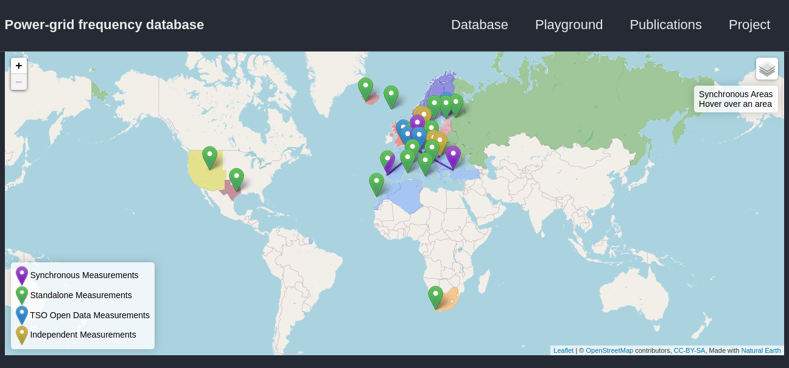

# Power-Grid Frequency

This repository is the front-end of the data repository [Power-Grid-Frequency-Data](https://github.com/LRydin/Power-Grid-Frequency-Data). The website [Power-Grid Frequency Database](https://lrydin.github.io/Power-Grid-Frequency/) contains all the relevant information on the content of this database.

This database of power-grid frequency is comprised of open data existent across three dimensions:
 - TSO data: Transmission System's Operator (TSO) recordings made public;
 - Research projects: Open-data database research projects;
 - Independent Gatherings: Industrial, private, or personal recordings that were made publicly available.

The data found here is always free for usage. It is processed, using a set of scripts found Power-Grid [Power-Grid-Frequency-Data](https://github.com/LRydin/Power-Grid-Frequency-Data/scripts), for research usage.

Currently the following recordings are available, under the three major categories described above:

# TSO data
## European Grids

The available recordings from Europe are of the following synchronous regions

Synchronous Area| Location | Provider | Resolution | Date range |
| --- | --- | --- | --- | --- |
| Continental Europe | Germany | [TransnetBW](https://www.transnetbw.com/en/energy-market/ancillary-services/control-reserve-demand-activation)|  1 sec | 2011-2019 |
|   | France |  [RTE](https://clients.rte-france.com/lang/an/visiteurs/vie/vie_frequence.jsp) | 10 sec | 2014-2020 |
| Nordic Grid | Finland | [FinGrid](https://data.fingrid.fi/en/dataset/frequency-historical-data) | 0.1 sec | 2015-2019 |
| National Grid (GB) | England | [NationalGrid ESO](https://www.nationalgrideso.com/balancing-services/frequency-response-services/historic-frequency-data) | 1 sec | 2015-2019 |

# Independent recording
## European Grid: Győr and Békéscsaba, Hungary and Central Jutland, Denmark
An independent recording by the Hungarian TSO MAVIR provided a week-long recording from Békéscsaba and Győr, Hungary, in the Continental European Grid.
An independent recording by the [ACES project](https://www.aces-bornholm.eu) in Central Jutland, Denmark for the year of 2019.

## Nordic Grid: Zealand, Denmark
An independent recording by the [ACES project](https://www.aces-bornholm.eu) in Zealand, Denmark, in the Nordic grid, for the years of 2018 and 2019.

# Research Projects
## Projects:
### Power grid frequency data base
This is a set of 19 recordings in 12 synchronous regions, spanning from 1 day to ~1 month in length, over 2017 to 2019, stored in the Open Science Framework [Power grid frequency data base](https://osf.io/by5hu/) from 2020.

It contains recordings from Reykjavík, Iceland, Vestmanna, Faroe Islands, Las Palmas de Gran Canaria, Canary Islands, Spain, Palma de Mallorca, Balearic Islands, Spain, Karlsruhe, Germany, Oldenburg, Germany, Istanbul, Turkey, Lisbon, Portugal, Lauris, France, Split, Croatia, Krakau, Poland, Erice, Sicily, Italy, London, United Kingdom, Tallin, Estonia, Stockholm, Sweden, Salt Lake City, Utah, USA, College Station, Texas, USA, Cape Town, South Africa, and St. Petersburg, Russia.

# Changelog
- Version 1.0 - Website online since July. Several contributions from other projects.
- Version 0.4 - Building first structure of the website.
- Version 0.3 - Moving to Github to produce a long-term repository.
- Version 0.2 - Moved to [JuGit](https://jugit.fz-juelich.de/) server
- Version 0.1 - Initial construction based files on a [Sciebo](https://www.sciebo.de/) folder

# Contributions
If you have open data from power-grid system, be it frequency, voltages, load, consumption, models, we will welcome all contributions to enhance this database. Our main concern at this point is power-grid frequency, but we are interested in all power-systems related data.

## Affiliated institutions and collaborators

This project came to life by Leonardo Rydin Gorjão in 2018 on a GitHub repository. Benjamin Schäfer and Mehrnaz Anvari contributed over the past two years this much of the support. Galib Hassan and Leonardo Rydin Gorjão designed the website. Johannes Kruse helped with the data and scripts. Benjamin Schäfer and Leonardo Rydin Gorjão have built up the collaboration that brought about part of the data.

### Funding
Helmholtz Association Initiative *Energy System 2050 - A Contribution of the Research Field Energy* and the grant No. VH-NG-1025.
